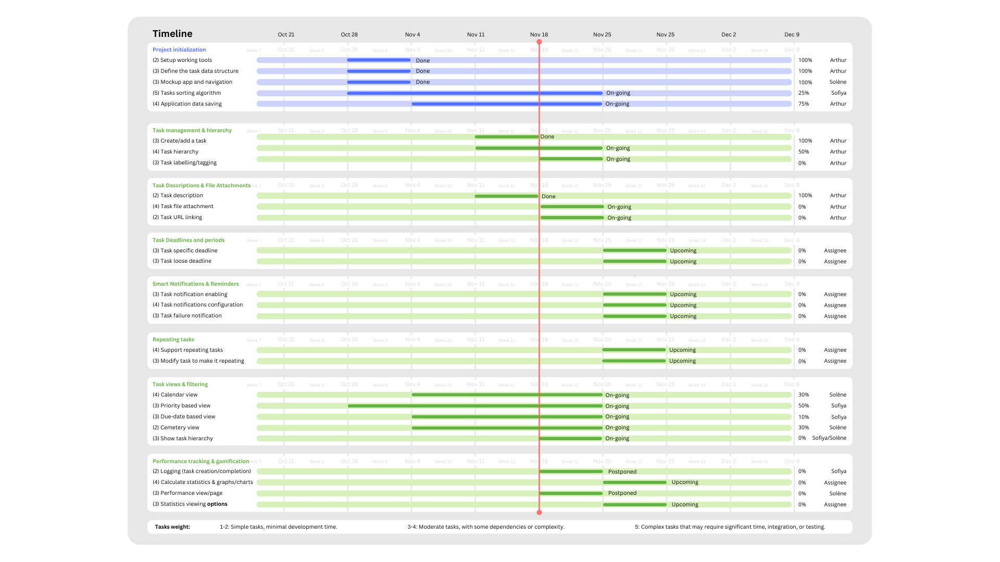

# Specifications
**SeoulTech_ASE_Autumn2024_Group2/Specifications**

## Gantt Timeline

## Folder content
- User stories and associated requirements and tasks
- Releases plans, organisation in time, tasks repartition

## External resources
### Trello / GitHub Project
For the repartition of tasks in time and within the team.  
- [Trello](https://trello.com/b/DvdygdkZ/seoultechaseautumn2024todoapp)  
- [GitHub Project](https://github.com/users/Sofiya-D/projects/9)  
### Canva
For the edition of documents
- [Project Proposal](https://www.canva.com/design/DAGSr2NJNkk/h00rf0x40fWYVzs7AiQ_Hg/edit?utm_content=DAGSr2NJNkk&utm_campaign=designshare&utm_medium=link2&utm_source=sharebutton)  
- [Requirements](https://www.canva.com/design/DAGTJHpkQ7w/RFnyYec0Rb5Vdf7RCDMe1g/edit?utm_content=DAGTJHpkQ7w&utm_campaign=designshare&utm_medium=link2&utm_source=sharebutton)  
- [Development Method](https://www.canva.com/design/DAGTJLLj-yk/3nO7R5G-wfUHFl_dJ0Ee2w/edit?utm_content=DAGTJLLj-yk&utm_campaign=designshare&utm_medium=link2&utm_source=sharebutton)  
- [Team Organization](https://www.canva.com/design/DAGTJCv3hRI/7faBxwbt2WOHG2TDCpoTJg/edit?utm_content=DAGTJCv3hRI&utm_campaign=designshare&utm_medium=link2&utm_source=sharebutton)  
- [Weekly Reports](https://www.canva.com/design/DAGTJBHjVhM/R-9AYlVWBpXRpYT5xjUZEg/edit?utm_content=DAGTJBHjVhM&utm_campaign=designshare&utm_medium=link2&utm_source=sharebutton)  
- [Brainstorming Draft Board](https://www.canva.com/design/DAGSr-hZxTk/7stD8M5IYpGqX-uxLq05cA/edit?utm_content=DAGSr-hZxTk&utm_campaign=designshare&utm_medium=link2&utm_source=sharebutton)  

